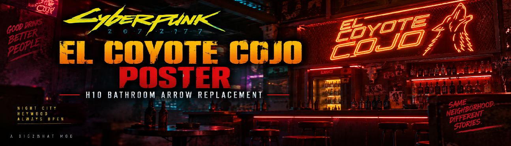
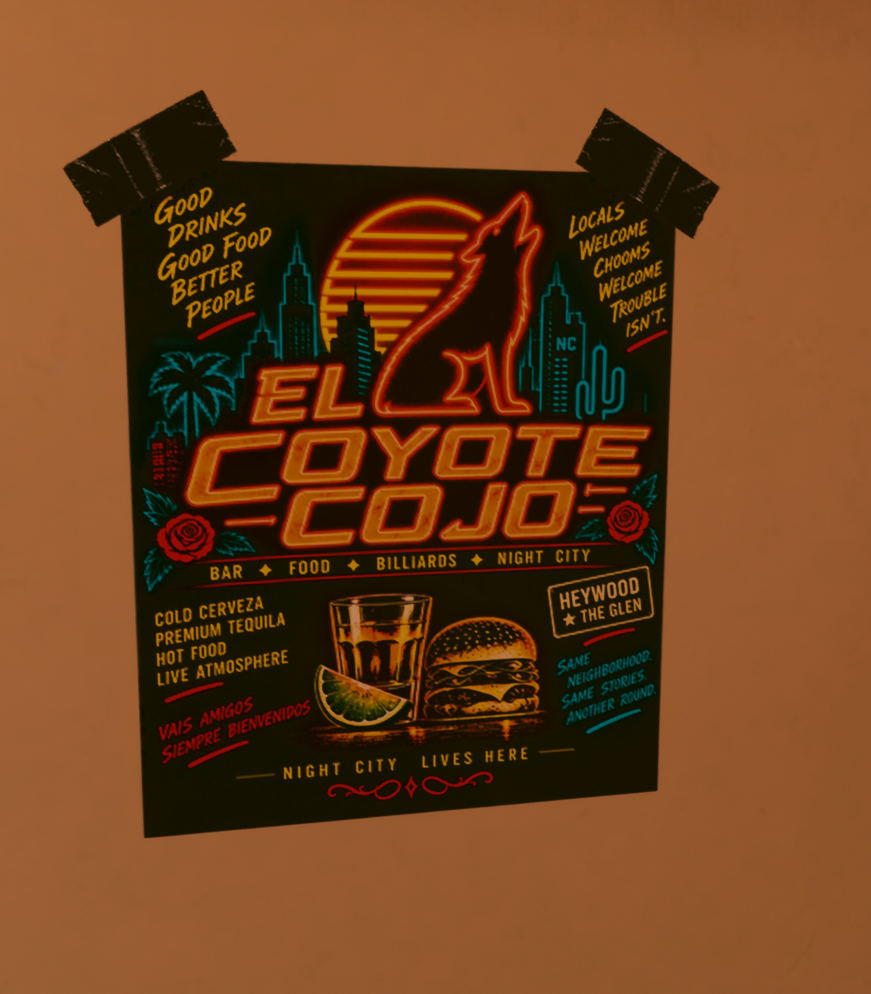

<div align="center">



# El Coyote Cojo Bar Poster - H10 Bathroom

**Bring a little piece of Heywood into V's H10 apartment.**


</div>

---

This mod replaces the vanilla shower/toilet directional arrows in V's H10 bathroom with a custom El Coyote Cojo advertisement, inspired by the iconic Heywood bar.

The poster is designed as an in-world Night City advertisement, featuring El Coyote Cojo's neon coyote identity, food, drinks, billiards, and Heywood styling. The original bathroom decal placement is retained so the poster looks naturally mounted to the wall rather than added as a separate object.

<p align="center">
  
</p>

---

## Features

- Custom El Coyote Cojo advertisement
- Replaces the H10 bathroom shower/toilet directional arrows
- Designed to blend naturally with Cyberpunk 2077's visual style
- Uses the existing in-game decal placement
- Updated and tested with Cyberpunk 2077 2.31
- No scripts
- No CET required
- No additional dependencies

---

## Installation

Install with Vortex, or manually place the included `.archive` file into:

```text
Cyberpunk 2077\archive\pc\mod
```

---

## Uninstallation

Remove the mod through Vortex, or delete its `.archive` file from:

```text
Cyberpunk 2077\archive\pc\mod
```

The original shower/toilet directional arrows will return.

---

## Compatibility

This mod replaces the H10 bathroom's

```text
shower_toilet_sign
```

material/texture.

Any other mod replacing the same bathroom sign will conflict. Use only one replacement for this decal at a time.

---

## Credits

Created by Big2What.

Built and tested using WolvenKit for Cyberpunk 2077 2.31.
